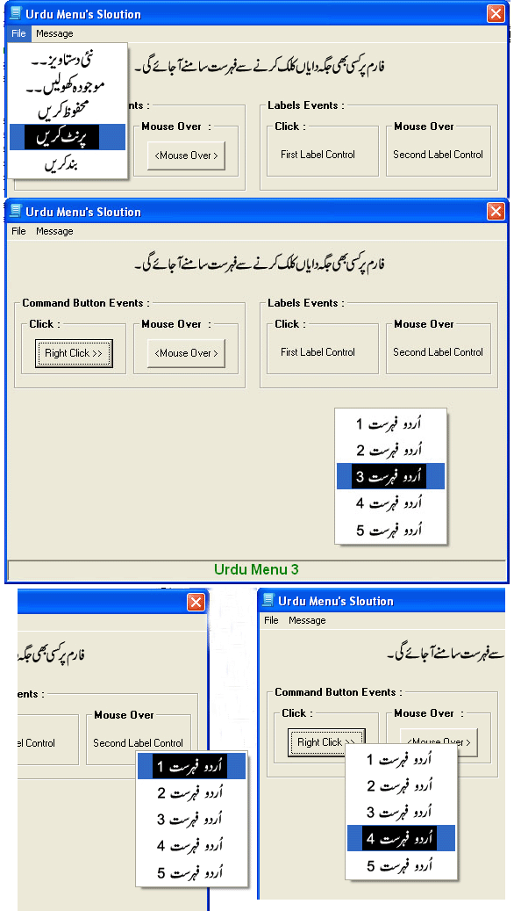



## Urdu Menus Solution

### Description

Pre-Requirements : Pak Urdu Installer Or East Asian Language Support (XP)

 http://www.mbilalm.com/download/ 

 Another solution for Urdu Programming ! This is the first Solution for making Urdu Menus in VB6. There is a example code of Urdu Menus on VB6 forms, you can understand by this code that how you can make Urdu Menus & deal with them.Two things are shown in the project, 1> How to make Top menu of the form, 2> How to make right click menu & appearance of that menu with 'Click & MouseOver' events. MS Form 2.0 Object Library again used in this project. There was no special need to use that object library but used because i think, that library objects are more reliable for Urdu programming because of there extra & specialized properties. No external source needed to make Urdu Menus. Checkout, I hope you all will like this Solution. Like before, Waiting for you Feedback at my E-Mail Address. Thank You. 

 Join Urdu Programming at Facebook 

 http://www.facebook.com/pages/Urdu-Programming-VB6/263338567072301 
 
### More Info
 

             |
---                |---
**Submitted On**   |2011-04-12 14:53:40
**By**             |[Mehmood Iqbal](https://github.com/Planet-Source-Code/PSCIndex/blob/master/ByAuthor/mehmood-iqbal.md)
**Level**          |Intermediate
**User Rating**    |5.0 (15 globes from 3 users)
**Compatibility**  |VB 6\.0
**Category**       |[Coding Standards](https://github.com/Planet-Source-Code/PSCIndex/blob/master/ByCategory/coding-standards__1-43.md)
**World**          |[Visual Basic](https://github.com/Planet-Source-Code/PSCIndex/blob/master/ByWorld/visual-basic.md)
**Archive File**   |[Urdu\_Menus2202224182011\.zip](https://github.com/Planet-Source-Code/mehmood-iqbal-urdu-menus-solution__1-73867/archive/master.zip)

